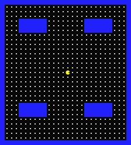
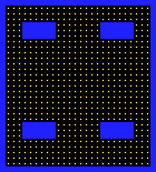
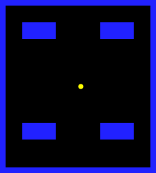

# PacmanLike

Un petit jeu d'arcade 2D de type *Pac-Man* en **HTML5 + JavaScript**, au rendu **pixel art** avec post-traitement **WebGL CRT** (scanlines, courbure, glitches de balayage), une **musique chiptune générée procéduralement**, et le support **clavier, tactile (smartphone) et manette (gamepad)**.

> 100 % côté client, **sans dépendance externe** ni serveur requis (un simple fichier HTML autonome suffit pour tester).



---

## Fonctionnalités

- **Jeu d'arcade Pac-Man-like** : labyrinthe, joueur, déplacement sur grille, tunnels latéraux.
- **Rendu pixel art** sur canvas 2D basse résolution (224×248), affiché via un **shader WebGL CRT** simulant un ancien moniteur à tube :
  - distorsion de barillet (courbure d'écran), vignettage, scanlines,
  - aberration chromatique RGB, scintillement,
  - **glitches de balayage** sporadiques (bande horizontale décalée).
- **Musique chiptune générée aléatoirement** respectant des règles d'harmonie (gamme de La mineur, progression I–IV–V–I), différente à chaque partie, via Web Audio.
- **Contrôles multi-device** :
  - **Clavier** : flèches ou ZQSD, `Espace`/`Entrée` (démarrer/pause), `P`/`Échap` (pause), `M` (mute).
  - **Manette** (Gamepad API) : croix directionnelle ou stick gauche, bouton `A`/`Start`, détection automatique à la connexion/déconnexion.
  - **Smartphone** : D-pad et bouton d'action tactiles transparents (affichés uniquement sur écran tactile, en paysage ou portrait).
- **Tutoriel de démarrage adaptatif** : affiche les contrôles correspondant au device d'entrée détecté (clavier / manette / tactile) et se met à jour dynamiquement.
- **Boîte de dialogue de paramètres** : réglage du volume et coupure de la musique, avec persistance dans `localStorage`.



---

## Démarrage rapide

### Option 1 — Fichier autonome (le plus simple)

Télécharge et ouvre directement [`pacmanlike-standalone.html`](pacmanlike-standalone.html) dans un navigateur moderne : tout est inliné (HTML + CSS + JS), aucune installation ni serveur requis.

```bash
# depuis un clone du dépôt
open pacmanlike-standalone.html      # macOS
xdg-open pacmanlike-standalone.html  # Linux
start pacmanlike-standalone.html     # Windows
```

> ⚠️ La politique d'autoplay des navigateurs impose un **premier geste utilisateur** pour démarrer l'audio. La musique se lance donc à la première action de démarrage de partie.

### Option 2 — Version modulaire (développement)

Comme le code utilise les **modules ES** (`import`/`export`), il faut un serveur statique pour respecter les règles CORS :

```bash
python3 -m http.server 8000
# puis ouvrir http://localhost:8000/ dans le navigateur
```

---

## Contrôles

| Plateforme | Action | Entrée |
|---|---|---|
| Clavier | Déplacement | Flèches ou ZQSD (AZERTY) / WASD |
| Clavier | Démarrer / Pause | `Espace` / `Entrée` |
| Clavier | Pause | `P` ou `Échap` |
| Clavier | Couper le son | `M` |
| Manette | Déplacement | Croix directionnelle ou stick gauche |
| Manette | Démarrer / Pause | Bouton `A` ou `Start` |
| Smartphone | Déplacement | D-pad tactile transparent (bas gauche) |
| Smartphone | Démarrer / Pause | Bouton d'action `⏯` (bas droite) |
| Tous | Volume / Mute | Bouton `⚙` du HUD → boîte de dialogue |

---

## Architecture

```
├── index.html              # Structure DOM (canvas 2D + canvas WebGL, HUD, overlay, contrôles)
├── styles.css             # Mise en page, pixel art, contrôles tactiles, media queries mobiles
├── main.js                # Point d'entrée : boucle à pas fixe, joueur, overlay/états, tutoriel
├── input.js               # Entrées unifiées : clavier + tactile + gamepad (Gamepad API)
├── music.js               # Musique chiptune générée procéduralement (Web Audio)
├── crt.js                 # Renderer WebGL1 (quad plein écran, texture, glitches)
├── shaders/
│   └── crt.glsl.js        # Vertex + fragment shaders CRT (GLSL)
├── pacmanlike-standalone.html  # Fichier autonome (tout inliné)
├── scripts/
│   ├── build-standalone.py # Générateur du fichier autonome
│   └── screenshot.js       # Générateur des screenshots
└── docs/
    ├── spec.md            # Spécification de conception détaillée
    └── screenshots/       # Captures d'écran
```

### Principes de conception

- **Sans dépendance externe** : JavaScript vanilla, Canvas 2D + WebGL1, Web Audio. Aucune bibliothèque ni bundler.
- **Boucle à pas fixe** (accumulateur) : simulation découplée du rendu, comportement déterministe.
- **Séparation des préoccupations** : rendu du jeu (canvas 2D source) → post-trichage d'affichage (WebGL CRT) ; entrées unifiées ; audio séparé.
- **Shaders GLSL** isolés dans un module dédié pour la lisibilité.
- **Sprites procéduraux** : dessinés par code, sans assets binaires externes.
- **Ressources audio procédurales** : musique et effets générés via Web Audio.

La spécification complète (objectif, règles, architecture, justifications) se trouve dans [`docs/spec.md`](docs/spec.md).

---

## Captures d'écran

### En jeu (joueur + pastilles)


### Labyrinthe seul (vue d'ensemble)


### Joueur seul



> Note : ces captures montrent le rendu du canvas 2D source (pixel art). Le rendu final dans le navigateur applique en plus le post-traitement CRT WebGL (scanlines, courbure, vignettage, aberration chromatique, glitches).

---

## Régénération des fichiers

### Fichier autonome

```bash
python3 scripts/build-standalone.py
# -> génère pacmanlike-standalone.html
```

### Screenshots

```bash
# nécessite le module npm `canvas` (node-canvas)
npm install canvas
node scripts/screenshot.js
# -> génère docs/screenshots/*.png
```

---

## Compatibilité

- Navigateurs modernes (Chromium, Firefox, Safari) supportant **WebGL1**, la **Gamepad API**, l'élément **`<dialog>`** et **Web Audio**.
- **Desktop** (clavier/souris/manette) et **mobile** (tactile).
- Fallback : si WebGL est indisponible, le canvas 2D source s'affiche sans effet CRT.

---

## Licence

Projet de démonstration / éducatif. Voir le dépôt pour les conditions.
